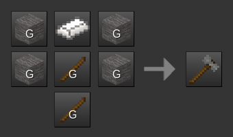

Quarry Mechanics [quarry]
================

By David G [kestral246@gmail.com]

This mod adds quarry mechanics to stone nodes.

What do I mean by that?
--------------------------

- Stone can now either be broken with a pickaxe (into cobble), or cut with a Quarry Hammer (into cut\_stone).

- The resulting cobble or cut\_stone nodes remain in place after digging, but since they're now falling nodes, they will fall if not supported. They can then be dug by hand to pick them up into ones inventory.

- For building, a Trowel and Mortar tool is provided. It can mortar placed cobble nodes into stonebrick nodes, and mortar placed cut\_stone nodes back into stone nodes.

Additional notes
----------------

- Stone, Desert Stone, Sandstone, Desert Sandstone, and Silver Sandstone are supported. Sandstone_rubble nodes are added, which correspond to cobble nodes for stone.

- A Quarry Hammer is only able to cut out a stone node if it has at least two faces open to the air (or water)—to be able to cut all its sides with the implied chisel. (With only one face open, it will break the stone to cobble.)

- When digging stone\_with\_ore nodes, the ore lump will enter inventory, while the remaining cobble node will be left behind.

- A scaffold node is provided to support the cobble and cut\_stone nodes while digging and mortaring them.

Crafting changes
----------------

- Cobble cannot be converted back into stone by melting it in a furnace.

- Cut\_stone\_blocks can be crafted from cut\_stone, which can then be mortered into the uncut versions.

- Stairs and slabs are supported for all stone types. However, they have to be crafted from cut or cobble versions, and then mortared into the solid or brick versions.

Updates
-------

- Added additional craft recipe for trowel using river water bucket.

- Removed stone group from slab and stair nodes.

- Added slab group to slab nodes, and stair group to stair nodes.

Optional recommended mods
----------------------

**Falling Dirt** by karlexceed ([falling\_dirt](https://content.minetest.net/packages/karlexceed/falling_dirt/)):

- Since the quarry mod makes cobblestone a falling node, using this mod will make dirt nodes more consistent by making them also falling.

**Note:**

- I've dropped the dependency on **Stonebrick Dungeons** by Hamlet, since this mod has been abandoned by the developer and deleted from ContentDB.

- The alternatives are to either live with collapsing dungeons, or to disable the "Dungeons" mapgen flag during world creation.

Craft Recipes
-------------

- **Note:** crafting a trowel will return an empty bucket (both water and river water buckets now supported).

Dependencies
------------

- required: default, bucket, stairs

- optional: falling\_dirt

Licenses
--------
Source code

> The MIT License (MIT)

Media (textures)

> Attribution-ShareAlike 3.0 Unported (CC BY-SA 3.0)

- Quarry Hammer, and Trowel and Mortar textures based on minetest game default_tool_stonepick texture.

- Scaffold texture based on minetest game default_stick texture.

- Rubble overlay textures based on minetest game default_desert_cobble texture.
