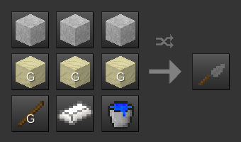

Quarry Mechanics [quarry]
=========================

By David G [kestral246@gmail.com]

This mod adds quarry mechanics to stone nodes.

What do I mean by that?
-----------------------

- Stone can now either be broken with a pickaxe (into cobble), or cut with a Quarry Hammer (into cut\_stone).

- The resulting cobble or cut\_stone nodes remain in place after digging, but since they're now falling nodes, they will fall if not supported. They can then be dug by hand to pick them up into ones inventory.

- For building, a Trowel and Mortar tool is provided. It can mortar placed cobble nodes into stonebrick nodes, and mortar placed cut\_stone nodes back into stone nodes.

Special notes
-------------

**What happens when this mod is installed in an existing world?**

- Existing cobble nodes will fall when touched. This is problematic since dungeons have cobble ceilings.

- Hamlet's stonebrick\_dungeons is a required dependency to deal with this problem, but it only works on newly-made dungeons, not preexisting ones.

- In addition, quarry currently only supports Minetest default game. It's likely that there are other mods that will conflict with this mod.

**What happens when this mod is removed from a world?**

- Cobble will stop being a falling node.

- And just like every other mod, all tools and nodes defined in this mod will become unknown.
 

Additional notes
----------------

- **New:** default:gravel now turns into quarry:gravel when dug. This is to prevent digging through the same gravel nodes over and over to find flint. (The texture is slightly lighter.)

- Cobble cannot be converted back into stone by melting it in a furnace.

- A Quarry Hammer is only able to cut out a stone if it has at least two faces open to the air (to be able to cut all its sides with the implied chisel).

- Stone, Desert Stone, Sandstone, Desert Sandstone, and Silver Sandstone are supported. Sandstone_rubble nodes are added, which correspond to cobble nodes for stone.

- Cut\_stone\_blocks can be crafted from cut\_stone.

- Stairs and slabs are supported for all stone types. However, they have to be crafted from cut or cobble versions, and then mortared into the solid versions.

- When digging stone\_with\_ore nodes, the ore lump will enter inventory, while cobble will be left behind.

- A scaffold node is provided to support the cobble and cut\_stone nodes while digging and mortaring them.

- Finally, for consistency, dirt nodes are also made falling, and the wooden pickaxe has optionally been removed and replaced with a flint pickaxe.

Craft Recipes
-------------

Early Game Considerations
-------------------------

By default, the wooden pickaxe has been removed. There are two other ways to get started digging stone:

- Find three flints (in gravel) and make a flint pickaxe.

- Find a dungeon that has cobble floors, and make a stone pickaxe (cobble can be picked up by hand).

However, there are two configuration options that could change this:

- quarry\_replace\_wooden\_pickaxe = false, will keep wooden pickaxe in game.

- stonebrick\_dungeons\_change\_floor = true, will get rid of cobble floors in dungeons.

Dependencies
------------
default, bucket, stairs, and [stonebrick\_dungeons](https://forum.minetest.net/viewtopic.php?f=11&t=18457) (by Hamlet)

*Since quarry mechanics changes cobble to falling nodes, stonebrick\_dungeons is needed to keep dungeons solid.*

Licenses
--------
Source code

> The MIT License (MIT)

Media (textures)

> Attribution-ShareAlike 3.0 Unported (CC BY-SA 3.0)
